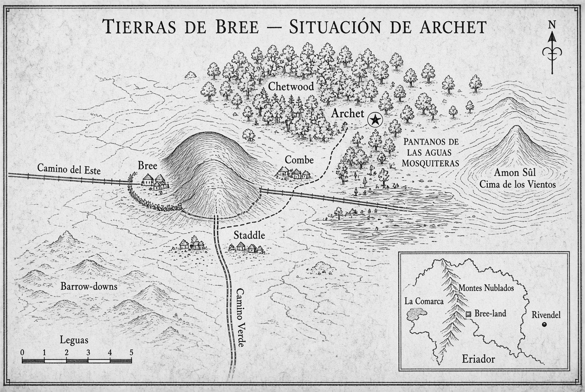

# Archet

El otoño de 3018 de la Tercera Edad llega temprano a las tierras de Eriador. Las tardes se acortan, el viento sopla con más fuerza entre los robles y los senderos se cubren de hojas húmedas. En la aldea de Archet, a poca distancia de Bree y al borde del bosque de Chetwood, la vida sigue su ritmo habitual hasta que, esta misma tarde, algo rompe la calma.

Os encontráis en la sala común de la posada La Jarra de Cebada. El fuego del hogar ilumina las mesas de madera oscura. El posadero, un hombre corpulento llamado Halric Cebadilla, sirve cerveza espesa y un estofado de raíz y cordero. Entre los parroquianos hay granjeros, un par de mercaderes de Bree y un montaraz silencioso que bebe solo en un rincón. La conversación gira en torno a los mismos temas de siempre hasta que entra una muchacha de unos dieciséis años, pálida y con el cabello revuelto. Se llama Elira y trabaja en la granja de los Thornhedge, al este del pueblo.

Cuenta, con voz temblorosa pero clara, que al atardecer vio a un hombre encapuchado dejar un objeto envuelto en tela oscura junto a las ruinas de una antigua atalaya dunlendina, a menos de una legua del pueblo. El desconocido se internó después en el bosque. Poco más tarde, Elira oyó aullidos de algo más temible que un simple lobo. Al regresar a la granja descubrió que dos ovejas habían desaparecido y que en el barro quedaban huellas demasiado grandes y profundas para un hombre común.

Halric Cebadilla confirma que en las últimas dos semanas tres viajeros que salieron hacia las Colinas del Viento no han vuelto. El montaraz del rincón, un hombre de mirada gris llamado Calen, levanta la vista por primera vez y dice que esa noche ha sentido un olor a hierro viejo y a carne quemada muy sospechoso.

El objeto que Elira describe es pequeño, del tamaño de un puño, y dice que al caer al suelo emitió un brillo pálido, como de luna sobre metal. Nadie en Archet reconoce esa luz.

## Desarrollo

La primera hora puede transcurrir en la propia posada y en las calles de Archet. Podéis interrogar a Elira con más detalle, hablar con Calen, revisar el registro de viajeros que lleva Halric o salir a examinar las huellas que aún quedan cerca de la granja Thornhedge. Cada conversación revela un dato distinto: el hombre encapuchado hablaba con acento del sur, llevaba un broche de cobre con forma de ojo cerrado y dejó atrás un trozo de tela negra con un bordado que recuerda a las marcas de los servidores de Isengard.

La segunda hora invita a abandonar el pueblo. El camino hacia las ruinas atraviesa un tramo de Chetwood donde los árboles crecen más juntos y la luz se filtra con dificultad. Allí podéis encontrar restos de un campamento abandonado a toda prisa, un cuervo muerto con una cinta de cuero atada a la pata y, si os acercáis con cuidado a la atalaya, el objeto envuelto. Al abrirlo descubrís una piedra ovalada de color grisáceo, marcada con runas élficas muy antiguas que hablan de “escucha” y de “puerta”. La piedra está tibia.

La tercera hora puede llevaros al interior de las ruinas o de vuelta al pueblo con la piedra en vuestro poder. En cualquiera de los dos casos aparece un nuevo elemento: un grupo de cuatro hombres de Dunland acompañados por un huargo herido. No atacan de inmediato. Su líder, un hombre llamado Grith, exige la piedra porque “el Blanco la reclama antes de que la reclame el Otro”. La negociación, la huida o el combate cierran la sesión y dejan abierta la pregunta de a quién pertenece realmente el artefacto y quién más lo busca.

# 
