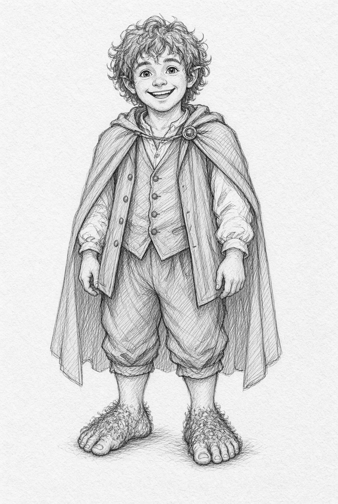
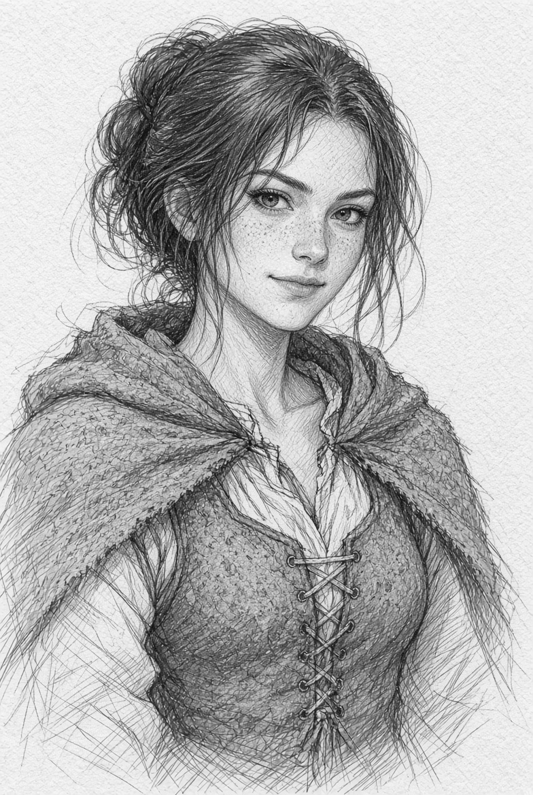
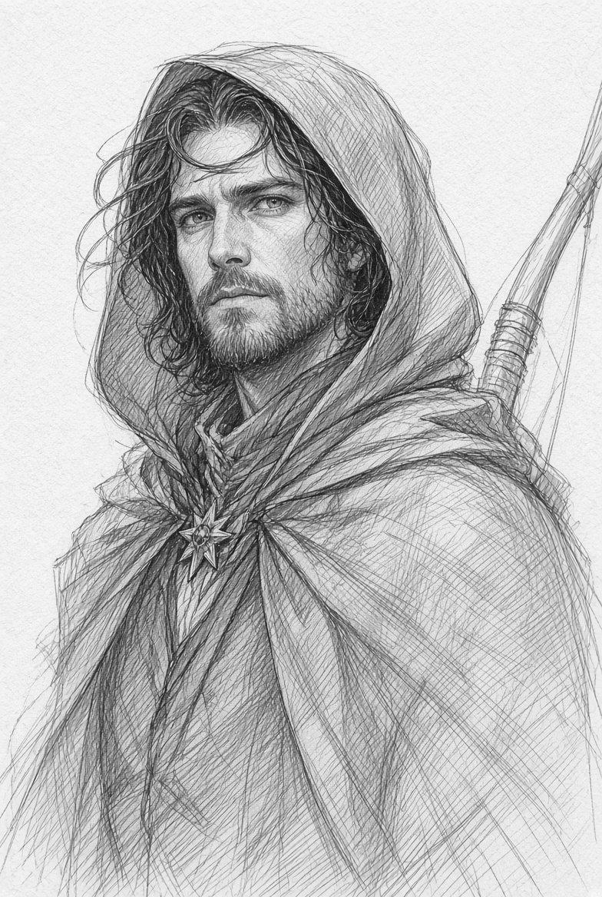
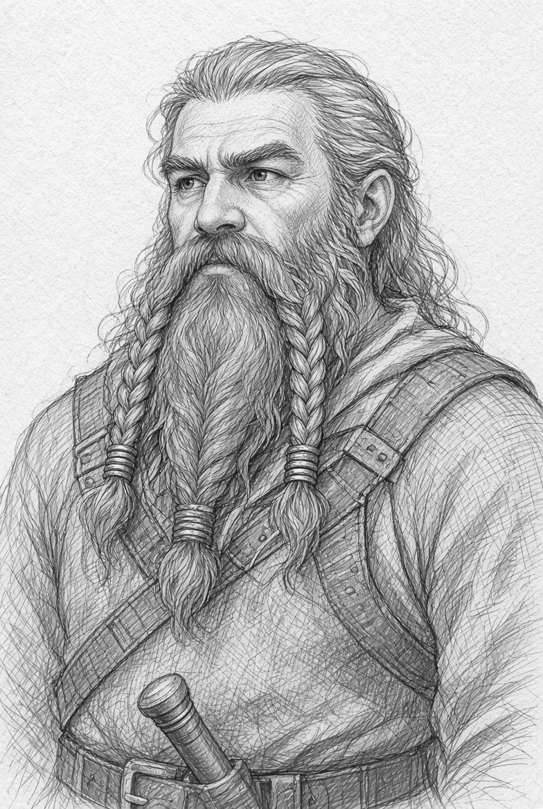
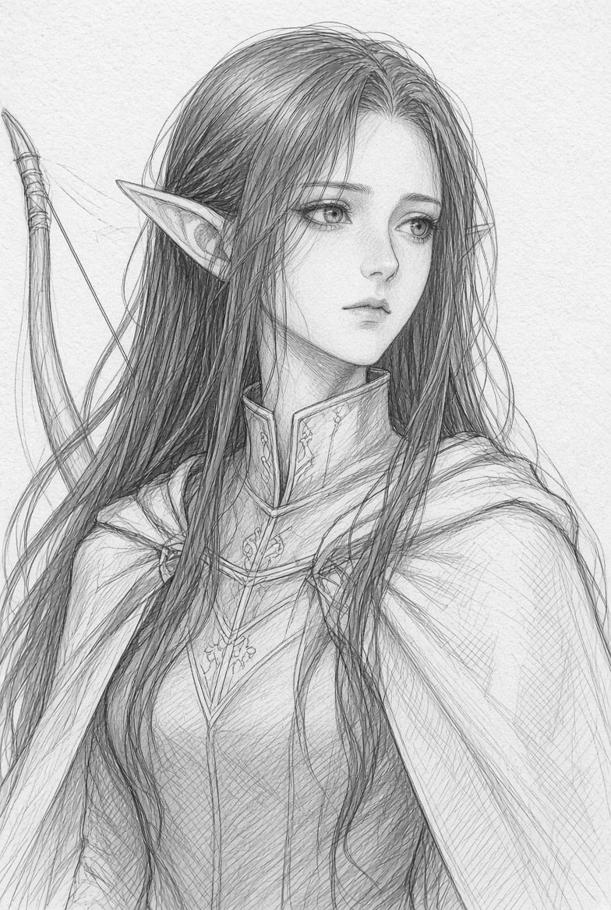
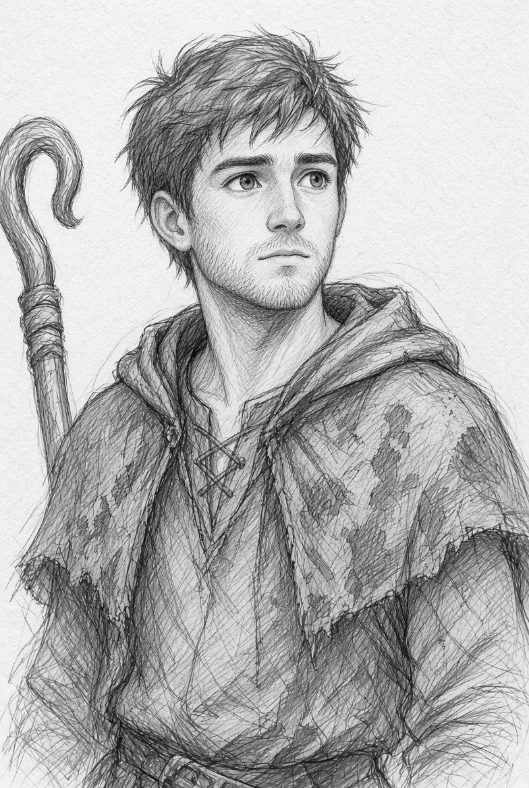

Personajes jugadores

El relato está pensado para un grupo de tres a cinco personajes de trasfondos distintos: un hobbit de la Comarca, un hombre de Bree, un montaraz, un enano de paso o un elfo viajero encajan todos con naturalidad. Cada uno puede aportar un motivo personal para quedarse en Archet esa noche: una deuda, una carta que debe entregar, la búsqueda de un pariente desaparecido o simple curiosidad.

Estas seis fichas encajan en la partida de Archet: un grupo mixto, con motivos claros para estar esa noche en La Jarra de Cebada y con lazos útiles para el gancho de Elira, el bosque y la piedra rúnica. Las ilustraciones siguen un mismo criterio: retrato tipo manga en escala de grises, trazado a lápiz, con líneas de construcción aún visibles.

### Tillo Bolger

Hobbit de Budgeford, en la Comarca. Veintinueve años.

Tillo tiene el rostro redondo, el cabello castaño muy rizado y la costumbre de hablar con las manos cuando se pone nervioso. Llegó a las Tierras de Bree con una carta y un cesto de quesos para un primo de Staddle. El primo está bien, el queso también, y Tillo ya debería haber emprendido el regreso. La historia de Elira y esa luz pálida junto a las ruinas le han dejado el corazón inquieto.

**Carácter:** cortés, curioso y leal. Come un bocado cuando necesita pensar. Recuerda voces, chismes y olores con una precisión que sorprende a los Hombres.

**Aptitudes destacadas:** moverse sin hacer ruido, escuchar tras una puerta, cocinar con lo que haya, lanzar una piedra con tino y ganarse la confianza de la gente sencilla.

**Equipo:** mochila de cuero, capa impermeable, navaja de mango de boj, pipa, yesca, un trozo de queso envuelto en tela y ocho monedas de plata.

**Lazo con la aventura:** pasó la tarde en La Jarra de Cebada y fue de los primeros en oír a Elira. Se siente responsable de una muchacha que le recuerda a su hermana pequeña.

### Edda Cercado

Mujer de Bree. Veintiséis años.

Edda conoce el nombre de casi todos los que cruzan el umbral de una posada. Trabaja a ratos en La Jarra de Cebada, lleva recados entre Bree, Staddle y Combe, y guarda en la manga una honda que usa con naturalidad. Tiene pecas, la mirada rápida y una sonrisa que aparece sobre todo cuando alguien intenta tomarle el pelo.

**Carácter:** directa, irónica y protectora con los vecinos. Prefiere una respuesta clara a un discurso largo.

**Aptitudes destacadas:** leer el ánimo de una sala, regatear, moverse por los caminos locales de noche, usar la honda y curar heridas leves con lo que hay en la cocina.

**Equipo:** honda y saquito de cantos, daga corta, linterna de cuerno, capa de lana parda, un anillo de llaves de la trastienda y una libreta con deudas ajenas.

**Lazo con la aventura:** Halric Cebadilla le pidió que acompañara a Elira de vuelta si la noche se torcía. Edda ya ha oído, en voz baja, que tres viajeros no regresaron del Camino del Este.

### Caranor, hijo de Halmir

Lazo con la aventura:Montaraz del Norte, de linaje dúnadan. Treinta y siete años.

Caranor habla poco y mira mucho. Lleva la barba corta, la capa del color del musgo y un broche sencillo en forma de estrella. Llegó a Archet siguiendo huellas que no cuadran con cazadores ni con mercaderes: hierro viejo, carne chamuscada y un acento del sur en una posada demasiado pequeña para tanto rumor.

**Carácter:** paciente, sobrio y difícil de asustar. Desconfía de las prisas y de quien vende certezas.

**Aptitudes destacadas:** rastrear, disparar con arco, sobrevivir a campo abierto, reconocer marcas de orcos y de hombres de Dunland, y hablar la lengua común con un dejo antiguo.

**Equipo:** arco largo, carcaj, espada corta, capa con capucha, saquito de hierbas, pedernal y un mapa marcado con tres cruces al este de Combe.

**Lazo con la aventura:** su capitán le pidió que vigilara los caminos entre Bree y las Colinas del Viento. La piedra que describe Elira encaja con un aviso que él recibió días atrás.

### Nár del Pico Azul

Enano de las Ered Luin. Noventa y cuatro años, todavía joven para su pueblo.

Nár viaja con herramientas, cerraduras y un cuaderno de cuentas. Una rueda de su carreta se partió a media legua de Archet y, mientras espera una pieza, escucha hablar de un metal que brilla como luna. La idea le parece poco seria hasta que alguien menciona runas.

**Carácter:** terco, hospitalario y orgulloso de su oficio. Cuenta historias de minas cuando la cerveza está buena.

**Aptitudes destacadas:** evaluar metales y piedras, reparar lo que se rompe, resistir el cansancio, ver en la penumbra y recordar un trato al detalle.

**Equipo:** martillo de forja de viaje, hacha corta, juego de ganzúas y limas, cuaderno, cuerda y un frasco de aceite.

**Lazo con la aventura:** si la piedra es obra élfica antigua, Nár quiere verla con sus propios ojos antes de que un extraño se la lleve. Además, Grith y sus hombres de Dunland ya preguntaron por un enano comerciante.

### Faelwen de los Puertos

Elfa de Lindon, de los que aún miran al mar. Aparenta unos veintidós años; ha visto ciento ochenta otoños.

Faelwen viaja hacia el este con un propósito discreto: un broche de su casa desapareció en manos de un mensajero y las últimas noticias lo sitúan cerca de Bree. Lleva el cabello oscuro suelto, una túnica gris clara y un cuaderno donde copia runas que encuentra en piedras olvidadas.

**Carácter:** serena, precisa y un poco distante. Canta en voz muy baja cuando camina entre árboles.

**Aptitudes destacadas:** percepción aguda, lectura de escrituras antiguas, arco ligero, curación con hierbas del bosque y lenguas de Elfos y Hombres.

**Equipo:** arco élfico sencillo, daga de hoja estrecha, manto gris, cuaderno de runas, tintero y un frasco de athelas seca.

**Lazo con la aventura:** las runas que Elira vislumbró sobre la piedra —escucha y puerta— pertenecen a un estilo que Faelwen estudió en los Puertos. Si la piedra es auténtica, alguien la está usando como reclamo.

### Osric Thornhedge

Hombre de Archet. Veintidós años. Sobrino de los dueños de la granja Thornhedge y primo de Elira.

Osric conoce cada sendero del borde del Chetwood porque ha perdido ovejas en todos ellos. Llegó a la posada con barro hasta las rodillas, el silbato de pastor al cuello y la certeza de que esas huellas grandes no son de ningún vecino. Quiere recuperar el ganado y, sobre todo, que Elira deje de salir sola al atardecer.

**Carácter:** honesto, impulsivo y valiente cuando alguien de su sangre está en peligro. Dice lo que piensa antes de medir las consecuencias.

**Aptitudes destacadas:** orientación en el Chetwood, rastreo de ganado y de gente, resistencia a pie, uso del bastón herrado y conocimiento de las granjas de Archet.

**Equipo:** bastón con contera de hierro, cuchillo de campo, capa de lana gruesa, silbato, hogaza y un farol de granja.

**Lazo con la aventura:** las dos ovejas desaparecidas son de su tío. Las huellas que Elira vio en el barro las siguió él mismo hasta el primer recodo del bosque, y allí se detuvo al oír el aullido.
