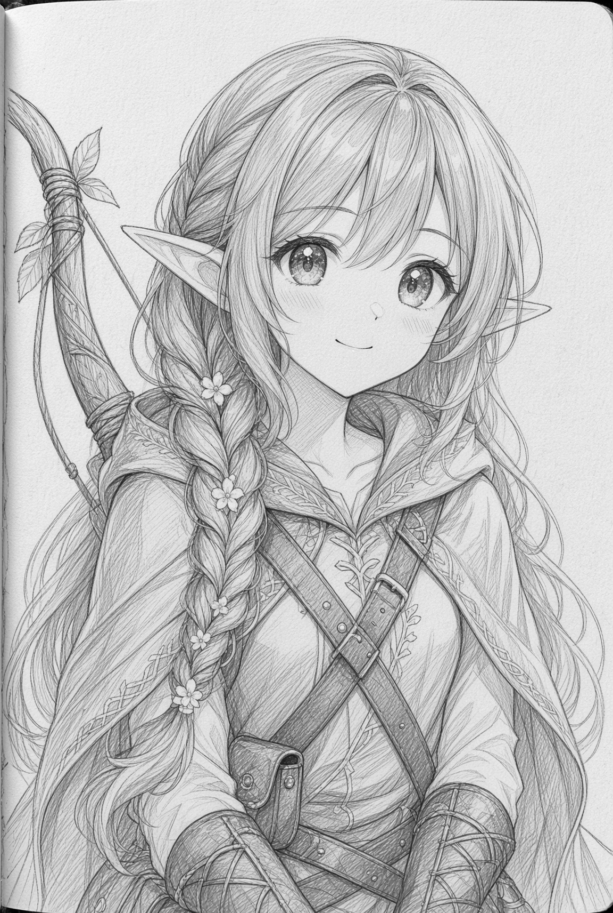
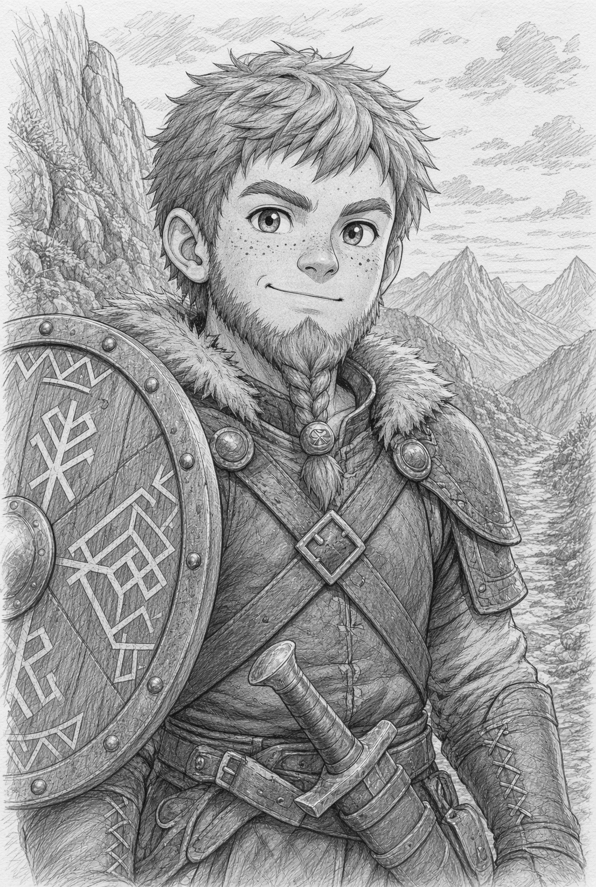
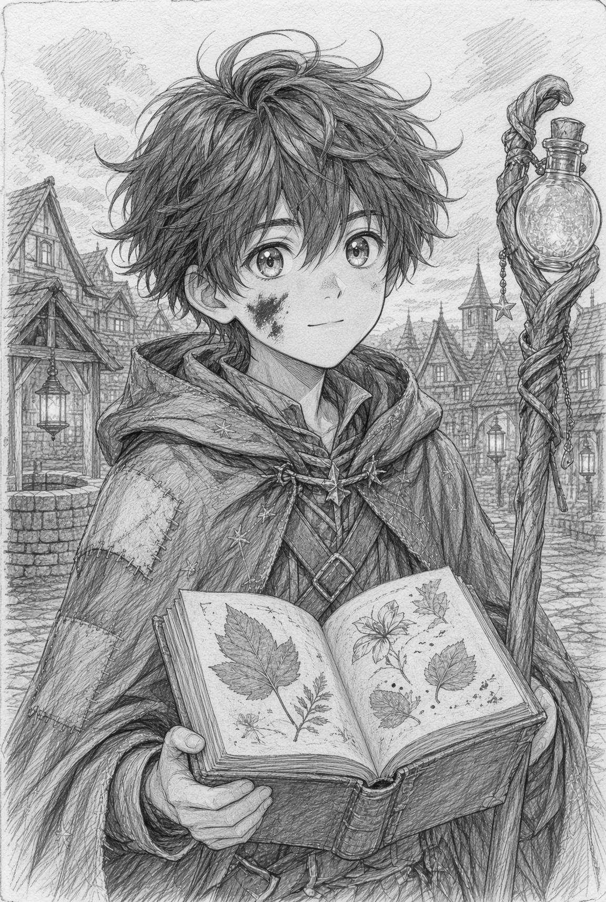
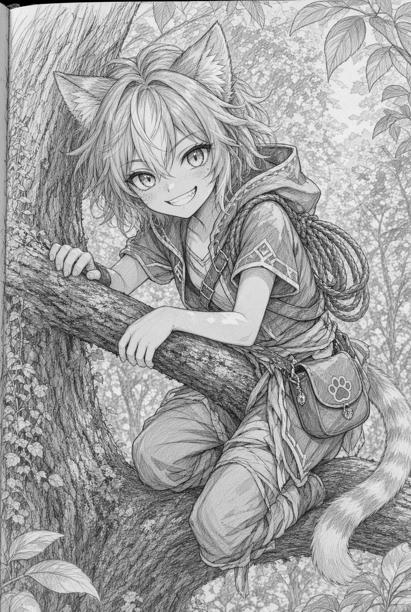
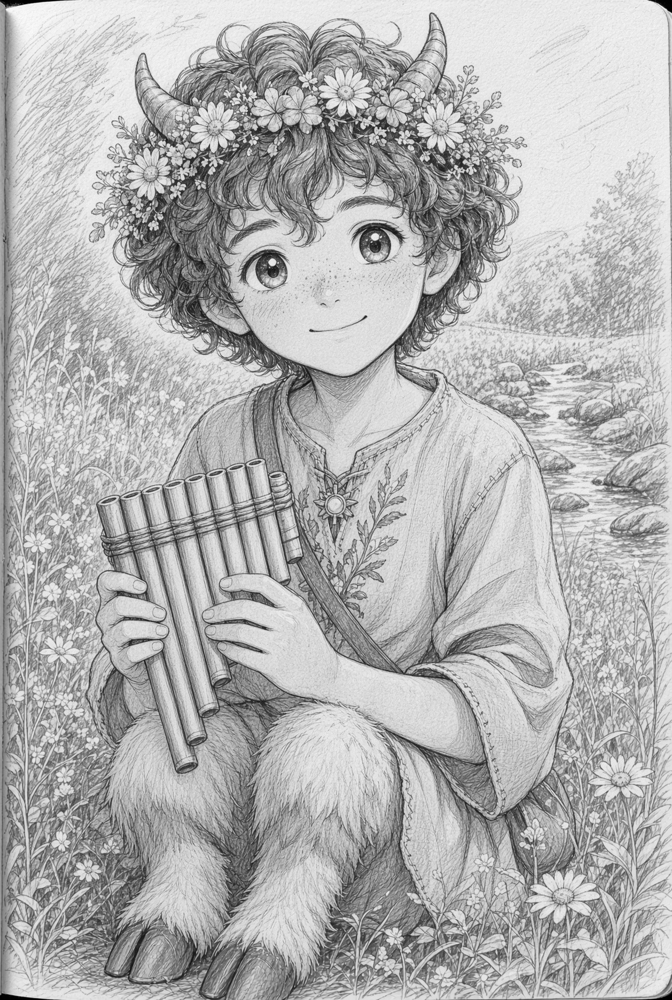
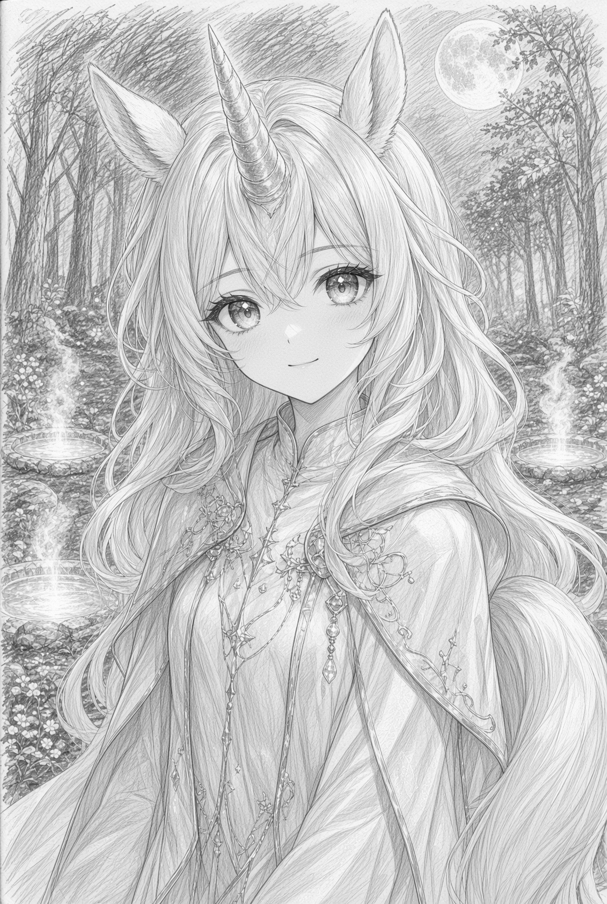

# La aldea de Robledanza

## Comienzo de aventura

En la aldea de Robledanza, al pie de los bosques de Dyss, la primavera ha llegado con un aire extraño y dulce. Los seis jóvenes héroes se encuentran juntos junto al pozo de las historias, donde siempre se reúnen cuando algo importante está a punto de suceder.

Lira es una elfa exploradora de pasos ligeros. Lleva un arco de sauce y suele escuchar primero a los pájaros antes de hablar. Brum es un enano guerrero de escudo runado y corazón leal; se coloca delante de sus amigos cuando percibe peligro. Nilo es un humano mago que guarda un cuaderno de hojas prensadas y pregunta por todo lo que brilla. Mishi es una chica gato pícara, rápida para trepar y para descubrir lo que otros pasan por alto. Canto es un fauno sanador que cura con canciones suaves y una flauta de caña. Estrella es una poni de unicornio maga cuyo cuerno emite una luz tibia; camina con dignidad y siente la magia de la tierra bajo los cascos.

De pronto el silencio se llena de un sonido de cascos muy suaves. Entre los árboles aparece un unicornio adulto de pelaje blanco lechoso y crin plateada. Su cuerno resplandece con destellos irregulares, como si una estrella se hubiera posado allí y ahora parpadeara. Se detiene ante el grupo, inclina la cabeza y habla con una voz clara y musical que todos comprenden.

El unicornio se llama Alba y viene del claro de las tres fuentes. Allí crece la Flor del Primer Rocío, una planta que solo abre sus pétalos cuando seis corazones distintos trabajan juntos. Esta noche la flor ha empezado a cerrarse antes de tiempo y el claro se oscurece. Alba pide ayuda para recoger tres gotas de rocío especial: una de la fuente que canta, otra de la fuente que sueña y otra de la fuente que recuerda. Con esas tres gotas la flor volverá a abrirse y el bosque recobrará su luz.

Alba ofrece a Estrella un hilo de su propia crin, que brilla al contacto con el cuerno de la poni. Ese hilo servirá de guía si el grupo se separa entre la niebla del claro. Luego el unicornio da un paso atrás y espera la decisión de los seis amigos.

En este momento cada personaje puede presentarse ante Alba, mostrar lo que mejor sabe hacer y decidir cómo emprender el camino hacia el claro. El bosque espera, las fuentes cantan a lo lejos y la primera aventura de Robledanza comienza con un unicornio que confía en ellos.

Aquí tienes las seis fichas listas para jugar en modo héroe de Magissa, pensadas para que cada niña o niño reconozca enseguida a su personaje. Junto a cada ficha va un retrato de estilo manga, luminoso y cercano al espíritu de cuento de Dyss.

El grupo suma siete dados de características en total por persona, con oficios distintos para que todos tengan un momento brillante en el claro de las tres fuentes. Puedes copiar los datos a las hojas oficiales o usar estas fichas tal cual.

# Personajes Jugadores

## Lira, elfa exploradora de Robledanza

*Lira Hojacanto* es una *elfa exploradora*. Su arco de sauce y su oído de bosque la convierten en la mirada del grupo.

**Apariencia:** cabello verde hoja trenzado con florecillas, orejas altas y mirada atenta. Voz suave, como quien no quiere asustar a los pájaros.

**Características:** Fuerza 1 dado. Agilidad 2 dados. Cuerpo 1 dado. Mente 2 dados. Encanto 1 dado.

**Habilidades:** Combate a distancia, Percibir, Rastrear y Sigilo.

**Valores de juego:** Movimiento 6. Defensa 4. Heridas 3. Energía 6.

**Equipo:** arco de sauce, aljaba con seis flechas emplumadas de jilguero, cuerda corta, cantimplora y un silbato de madera que imita el canto del mirlo.

**Don de raza:** comprende el lenguaje sencillo de las aves del bosque y distingue rastros recientes con facilidad.

**Frase habitual:** «El bosque ya nos está contando el camino.»

## Brum, enano guerrero

*Brum Piedralegre* es un *guerrero enano*. Su escudo runado y su paso firme hacen de él el ancla del grupo cuando el claro se oscurece.

**Apariencia:** estatura baja y ancha, barba joven trenzada con una cuenta de bronce, pecas y una sonrisa que aparece cuando protege a alguien.

**Características:** Fuerza 2 dados. Agilidad 1 dado. Cuerpo 2 dados. Mente 1 dado. Encanto 1 dado.

**Habilidades:** Combate cuerpo a cuerpo, Atletismo y Percibir.

**Valores de juego:** Movimiento 4. Defensa 5. Heridas 4. Energía 7.

**Equipo:** espada corta de familia, escudo redondo con una runa de amparo, mochila, manta de viaje y una piedra de afilar envuelta en paño.

**Don de raza:** ve con claridad en penumbra y aguanta más tiempo el cansancio que la mayoría de sus amigos.

**Frase habitual:** «Yo voy delante. Vosotros contadme lo que brilla.»

## Nilo, humano mago

*Nilo Cuadernoluz* es un *mago humano*. Su cuaderno de hojas prensadas guarda preguntas, dibujos y el primer hechizo que aprendió junto al pozo.

**Apariencia:** cabello oscuro revuelto, capa con parches de estrellas y un cuaderno atado con cinta roja. Siempre tiene una mancha de tinta en los dedos.

**Características:** Fuerza 1 dado. Agilidad 1 dado. Cuerpo 1 dado. Mente 2 dados. Encanto 2 dados.

**Habilidades:** Magia, Conocimiento e Interacción.

**Valores de juego:** Movimiento 5. Defensa 3. Heridas 3. Energía 8.

**Equipo:** bastón de avellano, cuaderno de hojas prensadas, tiza, una vela corta y una bolsita de polen luminoso.

**Don de raza y talento extra:** se adapta a cualquier oficio del grupo y recuerda con facilidad canciones, nombres y pequeños secretos del pueblo.

**Hechizo inicial:** Chispa de guía, una lucecita que señala el sendero durante un breve rato.

**Frase habitual:** «Si lo dibujo, lo entendemos mejor.»

## Mishi, chica gato pícara

*Mishi Zarparrápida* es una *chica gato pícara*. Trepa primero, escucha después y encuentra lo que el claro esconde entre raíces.

**Apariencia:** orejas de gato crema y jengibre, cola rayada que delata su humor, mirada viva y una capucha que casi nunca está del todo puesta.

**Características:** Fuerza 1 dado. Agilidad 3 dados. Cuerpo 1 dado. Mente 1 dado. Encanto 1 dado.

**Habilidades:** Sigilo, Tomar prestado, Atletismo y Combate a distancia.

**Valores de juego:** Movimiento 7. Defensa 4. Heridas 3. Energía 6.

**Equipo:** honda, bolsa de piedras lisas, cuerda con gancho ligero, capucha de hojas y un saquito para tesoros diminutos.

**Don de raza:** trepa troncos y tejados con la misma facilidad con que otros caminan, y aterriza de puntillas.

**Frase habitual:** «Yo miro desde arriba. Allí se ve el truco.»

## Canto, fauno sanador

*Canto Pradovivo* es un *fauno sanador*. Su flauta de caña calma heridas, miedos y hasta alguna fuente obstinada.

**Apariencia:** cuernitos cortos, pelo rizado, corona de margaritas y una flauta de caña colgada al cuello. Camina con un ritmo que invita a seguirlo.

**Características:** Fuerza 1 dado. Agilidad 1 dado. Cuerpo 2 dados. Mente 1 dado. Encanto 2 dados.

**Habilidades:** Curar, Interacción y Domar animales.

**Valores de juego:** Movimiento 5. Defensa 3. Heridas 3. Energía 8.

**Equipo:** flauta de caña, bolsa de hierbas de alivio, venda limpia, cantimplora de agua de manantial y un panal envuelto.

**Don de raza:** su música abre el corazón de las criaturas del prado y ayuda a que las heridas leves se cierren con más prisa.

**Hechizo inicial:** Alivio de la magissa, un soplo de calma que restaura un poco de Energía o suaviza una Herida.

**Frase habitual:** «Respira conmigo. La canción ya está trabajando.»

## Estrella, poni de unicornio

*Estrella Rocío* es una *maga unicornio*. Su cuerno recoge la luz de Alba y la convierte en guía para las tres fuentes.

**Apariencia:** cabello blanco plateado que cae como crin, cuerno en espiral de nácar, orejas altas y una cola sedosa. Cuando se emociona, el cuerno toma un brillo dorado.

**Características:** Fuerza 1 dado. Agilidad 1 dado. Cuerpo 1 dado. Mente 2 dados. Encanto 2 dados.

**Habilidades:** Magia, Encanto, Percibir y Curar.

**Valores de juego:** Movimiento 6. Defensa 3. Heridas 3. Energía 8.

**Equipo:** hilo de crin de Alba (guía en la niebla), diadema de rocío, satén para envolver las tres gotas y un broche en forma de flor cerrada.

**Don de raza:** su cuerno detecta magia viva y puede iluminar un camino breve cuando las fuentes se quedan en silencio.

**Hechizo inicial:** Luz de cuerno, un resplandor cálido que señala la gota de rocío más cercana.

**Frase habitual:** «Si el cuerno canta, la flor todavía nos espera.»
